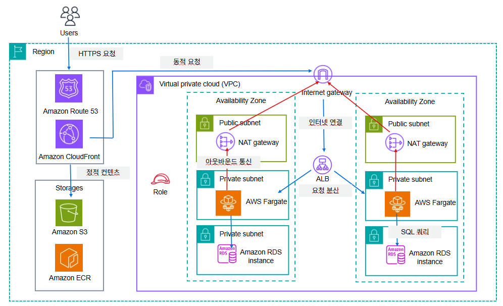

# Travelog - 여행 리뷰 공유 플랫폼

## 1. 프로젝트 소개

### 서비스 개요
**Travelog**는 사용자들이 여행 경험을 기록하고 공유할 수 있는 커뮤니티 플랫폼입니다.

### 주요 기능
- **회원 관리**: 일반 회원가입/로그인 및 카카오 소셜 로그인
- **리뷰 작성**: 여행지 리뷰 작성 및 다중 이미지 업로드 (평점, 카테고리, 태그 지원)
- **소셜 기능**: 좋아요, 북마크, 댓글/대댓글
- **인증/인가**: JWT 기반 Access/Refresh Token 관리
- **파일 관리**: AWS S3 + CloudFront를 통한 이미지 저장 및 배포

---

## 2. 시스템 아키텍처




### 네트워크 구성
- **VPC**: 10.0.0.0/16 (ap-northeast-2)
- **Public Subnet** (2AZ): ALB, NAT Gateway 배치
- **Private App Subnet** (2AZ): ECS Fargate 배치
- **Private DB Subnet** (2AZ): RDS MySQL 배치

### 보안 계층
- **ALB SG**: 80/443 포트 허용 (0.0.0.0/0)
- **ECS SG**: 8080 포트 (ALB SG만 허용)
- **RDS SG**: 3306 포트 (ECS SG만 허용)
- **Redis SG**: 6379 포트 (ECS SG만 허용)

---

## 3. 사용 기술 스택

### Backend
- **Language**: Java 17
- **Framework**: Spring Boot 3.5.5
- **ORM**: Spring Data JPA (Hibernate)
- **Security**: Spring Security + JWT
- **Template Engine**: Thymeleaf
- **Build Tool**: Gradle

### Database & Cache
- **RDS**: MySQL 8.x (db.t3.micro, 20GB)
- **Cache**: AWS ElastiCache Serverless (Redis)
    - Refresh Token 저장 (TTL: 7일)

### AWS Services
- **Compute**: ECS Fargate
- **Container Registry**: ECR
- **Load Balancer**: Application Load Balancer (ALB)
- **Storage**: S3 + CloudFront
- **Database**: RDS MySQL
- **Cache**: ElastiCache Serverless (Redis)
- **Network**: VPC, Subnet, IGW, NAT Gateway
- **Security**: Security Groups, IAM Roles
- **Monitoring**: CloudWatch Logs & Metrics

### DevOps & Tools
- **Container**: Docker (Multi-stage build)
- **CI/CD**: GitHub Actions (예정)
- **IaC**: AWS CloudFormation (YAML)
- **Monitoring**: CloudWatch

### External Services
- **OAuth**: Kakao Login
- **CDN**: CloudFront

---

## 4. AWS 인프라 구성

### VPC & 네트워크
```yaml
VPC CIDR: 10.0.0.0/16

서브넷 구성:
- Public Subnet A (10.0.1.0/24, ap-northeast-2a)
- Public Subnet C (10.0.2.0/24, ap-northeast-2c)
- Private App A (10.0.11.0/24, ap-northeast-2a)
- Private App C (10.0.12.0/24, ap-northeast-2c)
- Private DB A (10.0.21.0/24, ap-northeast-2a)
- Private DB C (10.0.22.0/24, ap-northeast-2c)
```

### ECS Fargate 설정
- **Task Definition**: 0.5 vCPU / 1GB Memory
- **Container Port**: 8080
- **Execution Role**: ECR 이미지 Pull 권한
- **Task Role**: S3, RDS, Secrets Manager 접근 권한
- **Deployment**: Rolling Update

### RDS MySQL
- **Engine**: MySQL 8.x
- **Instance**: db.t3.micro
- **Storage**: 20GB gp2
- **Multi-AZ**: Disabled (개발 환경)
- **Backup Retention**: 1-3일
- **Parameter Group**: utf8mb4, Asia/Seoul

### ElastiCache Redis
- **Type**: Serverless
- **SSL/TLS**: Enabled (필수)
- **용도**: Refresh Token 저장
- **TTL**: 7일 (자동 만료)

### S3 + CloudFront
- **S3 Bucket**: travelog-review-images
- **이미지 경로**: `/reviews/{postId}/image_{n}.jpg`
- **CloudFront**: OAI 적용, TTL 1일

### CloudFormation Stacks
인프라는 다음 스택으로 분리 관리:
1. `travelog_vpc.yaml` - VPC, Subnet, IGW, NAT
2. `travelog_sg.yaml` - Security Groups
3. `travelog_role.yaml` - IAM Roles
4. `travelog_rds.yaml` - RDS MySQL
5. `travelog_s3.yaml` - S3 + CloudFront
6. `travelog_ecs.yaml` - ECS Cluster, Service, Task Definition

---

## 5. 애플리케이션 구조

### 패키지 구조
```
com.example.boardpjt
├── config/                 # 설정 클래스
│   ├── RedisConfig         # Redis 연결 설정 (SSL, 커넥션 풀)
│   ├── SecurityConfig      # Spring Security + JWT
│   ├── S3Config           # AWS S3 클라이언트 설정
│   └── JpaConfig          # JPA Auditing 설정
├── controller/            # REST API 컨트롤러
│   ├── AuthController     # 로그인, 로그아웃, 회원가입
│   ├── PostController     # 리뷰 CRUD
│   ├── UserController     # 마이페이지, 프로필
│   └── CommentController  # 댓글 관리
├── service/               # 비즈니스 로직
│   ├── UserAccountService
│   ├── PostService
│   ├── CommentService
│   └── S3Service          # 이미지 업로드/삭제
├── model/
│   ├── entity/            # JPA 엔티티
│   │   ├── UserAccount
│   │   ├── Post
│   │   ├── PostImage
│   │   ├── Comment
│   │   ├── PostLike
│   │   ├── PostBookmark
│   │   └── RefreshToken   # Redis 저장용
│   ├── dto/               # 데이터 전송 객체
│   └── repository/        # JPA/Redis Repository
├── filter/                # Spring Security Filter
│   └── JwtAuthenticationFilter
├── handler/               # OAuth2 핸들러
├── util/                  # 유틸리티
│   ├── JwtUtil            # JWT 생성/검증
│   └── CookieUtil         # 쿠키 관리
└── exception/             # 예외 처리
```

### 주요 도메인 기능

#### 인증/인가
- **일반 로그인**: JWT Access Token (1시간) + Refresh Token (7일)
- **소셜 로그인**: Kakao OAuth2
- **Refresh Token**: Redis에 저장 (서버 측 검증)
- **로그아웃**: Cookie 삭제 + Redis Token 무효화 (에러 핸들링 포함)

#### 리뷰 관리
- **작성**: 제목, 본문, 평점(1-5), 카테고리, 태그
- **이미지**: 다중 업로드 (S3 저장 → CloudFront 배포)
- **수정/삭제**: 작성자 본인만 가능
- **조회**: 카테고리/태그 필터링, 페이징

#### 소셜 기능
- **좋아요**: 사용자별 중복 방지 (Composite Key)
- **북마크**: 나중에 읽기 기능
- **댓글**: 대댓글 지원 (self-referencing)

---

## 6. 배포 방법

### 로컬 빌드 및 테스트
```bash
# 1. 애플리케이션 빌드
./gradlew clean build

# 2. 로컬 실행 (dev 프로필)
./gradlew bootRun

# 3. Docker 이미지 빌드
docker build -t travelog-app:latest .

# 4. 로컬 Docker 실행
docker run -p 8080:8080 --env-file .env travelog-app:latest
```

### ECR 푸시 및 ECS 배포

#### Step 1: ECR 로그인
```bash
aws ecr get-login-password --region ap-northeast-2 \
  | docker login --username AWS --password-stdin \
  <AWS_ACCOUNT_ID>.dkr.ecr.ap-northeast-2.amazonaws.com
```

#### Step 2: Docker 이미지 빌드 및 태깅
```bash
# 이미지 빌드
docker build -t travelog-app:v1.0.0 .

# ECR 태그 추가
docker tag travelog-app:v1.0.0 \
  <AWS_ACCOUNT_ID>.dkr.ecr.ap-northeast-2.amazonaws.com/travelog-backend:v1.0.0
```

#### Step 3: ECR에 푸시
```bash
docker push <AWS_ACCOUNT_ID>.dkr.ecr.ap-northeast-2.amazonaws.com/travelog-backend:v1.0.0
```

#### Step 4: ECS Service 업데이트
```bash
# ECS Task Definition 업데이트 (새 이미지로)
aws ecs register-task-definition --cli-input-json file://task-definition.json

# ECS Service 강제 배포
aws ecs update-service \
  --cluster travelog-cluster \
  --service travelog-service \
  --force-new-deployment
```

### 배포 전략
- **Rolling Update**: 기존 Task를 유지하며 점진적 배포
- **최소 가용성**: 100% (다운타임 없음)
- **최대 가용성**: 200% (배포 중 이중 실행)

### 환경 변수 관리
배포 시 환경 변수는 **S3**에 `environment.env` 파일 업로드


---

## 7. 운영 및 모니터링

### CloudWatch Logs
#### 로그 확인 위치
- **Log Group**: `/ecs/travelog/app`
- **확인 방법**:
    1. AWS Console → CloudWatch → Logs → Log Groups
    2. `/ecs/travelog/app` 선택
    3. Stream별로 실시간 로그 조회

#### 주요 로그
- 애플리케이션 시작/종료
- HTTP 요청/응답 (Spring Boot 기본 로깅)
- Redis 연결 실패 에러
- S3 업로드 실패 에러
- JWT 검증 실패


### Health Check
- **ALB Target Group Health Check**:
    - Path: `/` (Spring Boot 기본 페이지)
    - Interval: 30초
    - Timeout: 5초
    - Healthy threshold: 2
    - Unhealthy threshold: 3

### 트러블슈팅 체크리스트

#### Redis 연결 실패
```bash
# 1. Security Group 확인
# ECS SG → ElastiCache SG (6379 포트) 허용 여부

# 2. ElastiCache 엔드포인트 확인
aws elasticache describe-serverless-caches --region ap-northeast-2

# 3. 로그 확인
# CloudWatch Logs → "Redis 연결 실패" 검색
```

#### RDS 연결 실패
```bash
# 1. Security Group 확인
# ECS SG → RDS SG (3306 포트) 허용 여부

# 2. RDS 엔드포인트 확인
aws rds describe-db-instances --region ap-northeast-2

# 3. 환경변수 확인
# ECS Task Definition → DB_URL, DB_USERNAME, DB_PASSWORD
```

#### S3 업로드 실패
```bash
# 1. IAM Role 권한 확인
# ECS Task Role → s3:PutObject 권한 있는지

# 2. 버킷 정책 확인
aws s3api get-bucket-policy --bucket travelog-review-images
```

### 대시보드
**CloudWatch Dashboard 생성 권장 항목**:
1. ECS CPU/Memory 그래프
2. ALB Request Count 그래프
3. RDS Connection Count 그래프
4. 5XX Error Count 그래프
5. 최근 로그 위젯 (실시간 모니터링)

---

## 8. 관련 문서

### 상세 설계 문서
- [인프라 상세 설계 (LLD)](docs/infra-lld.md)
- [데이터베이스 설계](docs/db-design.md)
- [DevOps 계획서](docs/devops-plan.md)
- [API 문서](docs/api.md)

### 스키마
- [DB 스키마 SQL](db/schema.sql)

### CloudFormation 템플릿
- [VPC 구성](infra/travelog_vpc.yaml)
- [Security Groups](infra/travelog_sg.yaml)
- [IAM Roles](infra/travelog_role.yaml)
- [RDS MySQL](infra/travelog_rds.yaml)
- [S3 + CloudFront](infra/travelog_s3.yaml)
- [ECS Fargate](infra/travelog_ecs.yaml)

---

## 8. 팀원 및 역할
- **아키텍트/PM** : 전체 일정 관리, 아키텍처 다이어그램, 최종 발표
    - 최예진
- **인프라(AWS)** : VPC, 서브넷, ALB, ECS/EKS, RDS, S3, API GW 등
    - 강태우
- **백엔드 1** : 핵심 비즈니스 로직, JPA, Security, 컨트롤러
- **백엔드 2** : 옵션 모듈(DDB/SQS 등) 연동, API 스펙 정리
    - 서은정, 심소현
- **DevOps & 운영 문서(릴리즈/운영 담당)** : Docker/ECR, GitHub Actions, README/문서, 모니터링, 발표자료
    - 김진호
